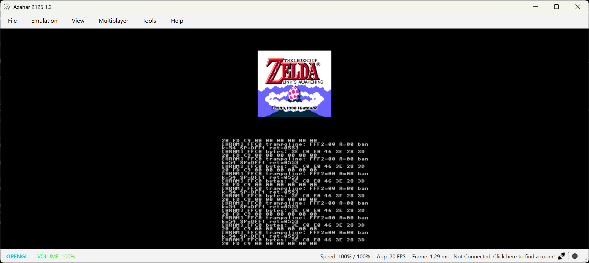
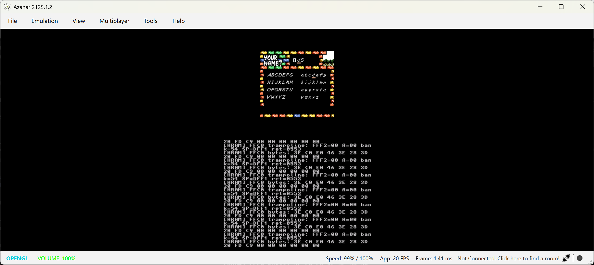
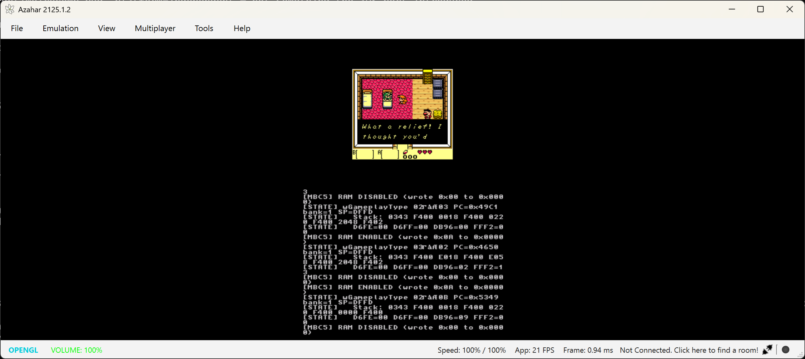
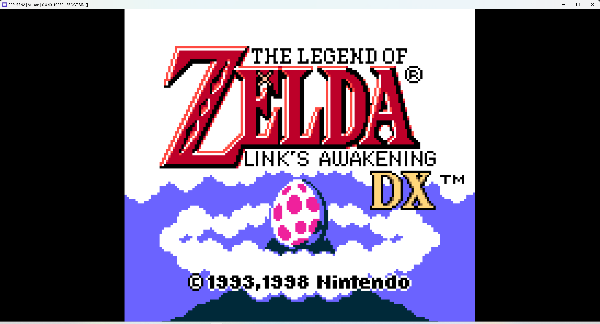
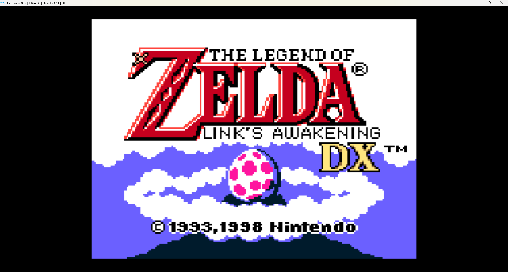

# linksawakening-portable

Multi-platform port of the static recompilation of *The Legend of Zelda:
Link's Awakening DX* (Game Boy Color). The game is recompiled to native C;
each platform gets a backend implementing one shared interface. **Running
on PlayStation 4, PlayStation 3, Nintendo 3DS, and Nintendo Wii** (plus the
Windows reference build).

**→ Build instructions for every platform: [docs/BUILDING.md](docs/BUILDING.md)**

## Screenshots

| 3DS — title (Azahar) | 3DS — name entry | 3DS — gameplay |
|----------------------|------------------|----------------|
|  |  |  |

| PS3 — title (RPCS3) | Wii — title (Dolphin) |
|---------------------|-----------------------|
|  |  |

Built on:

- **[`sp00nznet/LinksAwakening`](https://github.com/sp00nznet/LinksAwakening)**
  — the upstream game project: the `rom_main.c` entry point, `rom.h`, and the
  build glue. The recompiler output (`rom.c`, `rom_rom.c`) is generated locally
  from your own ROM and is never committed.
- **[`sp00nznet/gb-recompiled`](https://github.com/sp00nznet/gb-recompiled)**
  (fork of [`arcanite24/gb-recompiled`](https://github.com/arcanite24/gb-recompiled))
  — the runtime engine (`gbrt`, `ppu`, `audio`, `interpreter`, `menu_gui`, plus
  the SDL2 platform layer in `platform_sdl.cpp` and `platform_sdl.h`). Vendored
  at `runtime/`.

> **Status** (Windows reference build works — 25 MB `rom.exe`):
>
> | Platform | Backend | State |
> | --- | --- | --- |
> | **PlayStation 4** | `platform_sdl.cpp` (OpenOrbis SDL2) | ✅ **Running on real hardware.** Installable `linksawakening.pkg` (20 MB). |
> | **PlayStation 3** | `platform_psl1ght.c` (native PSL1GHT) | ✅ **Running in RPCS3 at ~56 FPS** — title + gameplay. `EBOOT.BIN` (25 MB). |
> | **Nintendo 3DS** | `platform_3ds.c` (native libctru) | ✅ **Running in Azahar *and* on a real New 2DS XL** — reaches gameplay. `linksawakening.3dsx` (22 MB). |
> | **Nintendo Wii** | `platform_wii.c` (native libogc) | ✅ **Running in Dolphin** — title screen + intro. `linksawakening.dol` (24 MB). |
> | **Xbox 360** | `platform_libxenon.c` (native libxenon) | ⏸ Parked — full-game XEX hits a memory error in Xenia. |
> | **WebAssembly** | `platform_sdl.cpp` (Emscripten SDL2) | ⏸ Blocked — recompiler emits functions over wasm's 7.65 MB per-function cap. |
>
> Big-endian targets (PS3, Wii, and the parked 360) are carried by the
> AF/BC/DE/HL register-pair fix in `gbrt.h`. See
> [docs/BUILDING.md](docs/BUILDING.md) to build any of them.

---

## The big architectural insight

The upstream `gb-recompiled` runtime **already has a Platform Abstraction Layer**:
`runtime/include/platform_sdl.h` defines a 13-function `gb_platform_*` contract
that the rest of the runtime calls into (init, poll events, render frame, vsync,
get joypad, save/load state, set title). `platform_sdl.cpp` is the SDL2
implementation of that contract.

That means **per-target porting is mostly: write a sibling `platform_<target>.cpp`
that satisfies the same header.** No runtime refactor required.

```
runtime/include/platform_sdl.h        ← the contract (do not rename)
runtime/src/platform_sdl.cpp          ← SDL2 backend       (Windows / macOS / Linux / WASM-via-SDL)
runtime/src/platform_libxenon.cpp     ← Xbox 360 backend   (Phase 4)
runtime/src/platform_nxdk.cpp         ← Original Xbox      (later)
runtime/src/platform_psl1ght.cpp      ← PS3                (later)
runtime/src/platform_kos.cpp          ← Dreamcast          (later)
```

The CMakeLists.txt picks which `platform_*.cpp` to build based on the target
toolchain file (added in Phase 4).

---

## Roadmap

**Foundation** — shared groundwork, all done:

- Repo scaffold and the Windows reference build.
- PAL contract audit — [docs/PAL_AUDIT.md](docs/PAL_AUDIT.md): the runtime
  already exposes a clean platform interface; the core engine makes no
  direct SDL/ImGui calls.
- Endianness + 32-bit audit — [docs/ENDIAN_AUDIT.md](docs/ENDIAN_AUDIT.md):
  the one fix big-endian targets need is the AF/BC/DE/HL register-pair
  layout in `gbrt.h`.
- gb-recompiled cross-compile patches: `LA_HAS_MULTIPLAYER` / `LA_HAS_IMGUI`
  build gates, plain-C menu/asset-viewer stubs, and the big-endian
  register-pair fix — so the runtime builds for any target.

**Platforms** — see the [status table](#linksawakening-portable) above:
PS4, PS3, 3DS, and Wii are playable; Xbox 360 is parked; WebAssembly is blocked.

**Open work:**

- **WebAssembly** — the recompiler emits functions larger than WebAssembly's
  ~7.65 MB per-function limit. Needs the recompiler to split oversized
  functions (`gb_dispatch` and a few giant recompiled routines) before a
  wasm build can link.
- **Xbox 360** — `platform_libxenon.c` is written and a hello-world XEX runs
  in Xenia, but the full-game XEX hits a Xenia memory error. Likely needs
  real RGH/JTAG hardware to validate.
- **Settings persistence** — a `gb_platform_fs_read/write` PAL extension so
  rebindable controls survive on targets without plain stdio.
- **More targets** — PSP, GameCube, and others are feasible with the same
  one-backend-per-platform pattern; none started.

---

## Repository layout

```
linksawakening-portable/
├── README.md                       # this file — keep the phase table current
├── .gitignore                      # ROM, recompiler output, build artifacts excluded
├── CMakeLists.txt                  # Windows/SDL2 build (LA_MULTIPLAYER=ON by default)
├── rom_main.c                      # Entry point (from sp00nznet/LinksAwakening)
├── rom.h                           # Generated declarations
├── rom.c                           # gitignored — 115 MB recompiler output
├── rom_rom.c                       # gitignored — 6.3 MB ROM-as-C-array
├── runtime/                        # Vendored from gb-recompiled
│   ├── include/
│   │   ├── platform_sdl.h          # ★ THE PAL — implement this per target
│   │   ├── gbrt.h, ppu.h, audio.h, hwtrace.h, gbrt_debug.h
│   ├── src/
│   │   ├── gbrt.c                  # 52 KB — CPU + memory + bank switching
│   │   ├── ppu.c                   # 23 KB — scanline PPU with CGB support
│   │   ├── audio.c                 # 23 KB — APU mixer
│   │   ├── interpreter.c           # 39 KB — fallback for unresolved indirect jumps
│   │   ├── hwtrace.c               # 5 KB  — debug trace
│   │   ├── platform_sdl.cpp        # 38 KB — SDL2 PAL implementation
│   │   ├── menu_gui.cpp            # 41 KB — ImGui menu
│   │   ├── asset_viewer.cpp        # 27 KB — debug asset viewer
│   │   └── multiplayer/            # mp_*.cpp (only built when LA_MULTIPLAYER=ON)
│   └── third_party/
│       ├── imgui/                  # base menu uses this — always built
│       └── enet/                   # only built when LA_MULTIPLAYER=ON
├── tools/                          # Debug tracing tools (SameBoy headless ref tracer)
└── docs/
    └── PORTING.md                  # PAL interface, endianness checklist, backend matrix
```

---

## ROM handling — no copyrighted content in this repo

This repository contains **no game ROM and no recompiled game code.** The
three recompiler-output files — `rom.c`, `rom.h`, `rom_rom.c` — are derived
from a Game Boy ROM and are `.gitignore`d. You generate them yourself by
running [gb-recompiled](https://github.com/sp00nznet/gb-recompiled) against
a **legally obtained** Link's Awakening DX ROM, then drop them at the repo
root. See [docs/BUILDING.md](docs/BUILDING.md).

What *is* in the repo: the platform backends, build scripts, and the
vendored open-source runtime — all of it freely redistributable (see
[Credits](#credits)).

---

## Building

Full step-by-step instructions for every platform — toolchain setup, build
commands, and how to install/run — are in **[docs/BUILDING.md](docs/BUILDING.md)**.

Quick start for the Windows reference build (MSYS2 + MinGW64 + SDL2 + CMake + Ninja):

```bash
export PATH="/c/msys64/mingw64/bin:$PATH"
cmake -S . -B build -G Ninja -DCMAKE_BUILD_TYPE=Release
cmake --build build
./build/rom.exe
```

---

## What gets reused vs replaced per platform

**Reused as-is on every target:**

- `rom.c`, `rom.h`, `rom_main.c` (well — `rom_main.c` after the Phase 6 MP guard)
- `rom_rom.c` (ROM data as byte array — already endian-clean)
- All of `runtime/src/*.c` (CPU, PPU, audio, interpreter, hwtrace)
- `runtime/src/menu_gui.cpp` and `asset_viewer.cpp` (depend only on ImGui and the PAL contract)

**Per-platform:**

- `runtime/src/platform_<target>.cpp` — the PAL implementation
- ImGui backend — for SDL2 it's `imgui_impl_sdl2.cpp` + `imgui_impl_sdlrenderer2.cpp`;
  for libxenon it'd be a custom Xenos backend (or stub the menu entirely)
- CMake toolchain file (`cmake/toolchain-<target>.cmake`)
- Packaging glue (`.xex`, `.apk`, `.wasm`)

**Audit-then-keep:**

- Anything in the runtime that does `*(uint16_t*)ptr` / reinterpret loads
  — needs byte-by-byte access on big-endian (PPC) targets
- 64-bit assumptions in pointer math (most targets are 32-bit user space)

---

## Credits

**Game**
- *The Legend of Zelda: Link's Awakening DX* © 1993, 1998 Nintendo / Grezzo.
  Not affiliated with or endorsed by Nintendo. No game ROM or game code is
  distributed here.

**Recompilation**
- [`arcanite24/gb-recompiled`](https://github.com/arcanite24/gb-recompiled) — the
  Game Boy static recompiler, and [`sp00nznet/gb-recompiled`](https://github.com/sp00nznet/gb-recompiled)
  the runtime fork vendored at `runtime/`.
- [`sp00nznet/LinksAwakening`](https://github.com/sp00nznet/LinksAwakening) — the
  upstream LA DX game project.
- [LADX-Disassembly](https://github.com/zladx/LADX-Disassembly) contributors — the
  reverse-engineering work the recompiler builds on.
- [SameBoy](https://github.com/LIJI32/SameBoy) by LIJI32 — reference emulator used
  for hardware-trace comparison.
- Multiplayer overlay (optional): [`sp00nznet/la-mp`](https://github.com/sp00nznet/la-mp).

**Vendored libraries** (`runtime/third_party/`)
- [Dear ImGui](https://github.com/ocornut/imgui) by Omar Cornut — MIT.
- [ENet](https://github.com/lsalzman/enet) by Lee Salzman — MIT.

**Platform toolchains & SDKs**
- 3DS: [devkitPro / devkitARM + libctru](https://devkitpro.org/).
- Wii: [devkitPro / devkitPPC + libogc](https://devkitpro.org/).
- PS3: [PSL1GHT](https://github.com/ps3dev/PSL1GHT) / the ps3dev project.
- PS4: [OpenOrbis PS4 Toolchain](https://github.com/OpenOrbis/OpenOrbis-PS4-Toolchain).
- Xbox 360: [libxenon](https://github.com/Free60Project/libxenon) / Free60.
- WebAssembly: [Emscripten](https://emscripten.org/).
- SDL2: [libsdl-org/SDL](https://github.com/libsdl-org/SDL).

## License

The platform-port code original to this repository (the `platform_*` backends,
build scripts, CMake glue, `rom_main.c`) is released under the **MIT License** —
see [LICENSE](LICENSE). Vendored components keep their own licenses (ImGui and
ENet ship `LICENSE` files under `runtime/third_party/`).

This is a non-commercial, educational / preservation project. It distributes no
copyrighted Nintendo content — you must supply your own legally obtained ROM.
